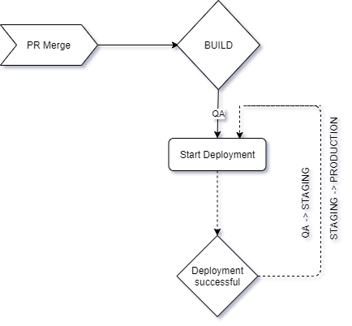
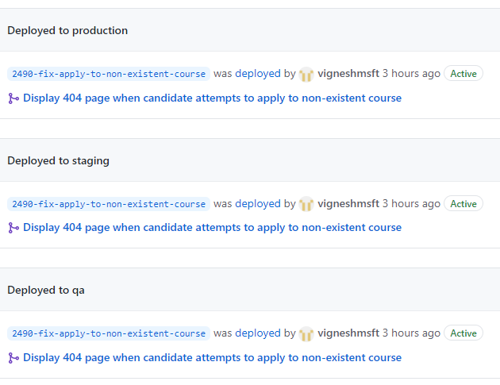
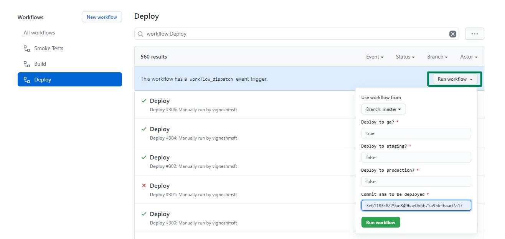

# Deployment

The application is hosted on [GOV.UK PaaS](https://login.london.cloud.service.gov.uk) in the London region and has the below three environments:

| Environment   | Space       | URL |
| ------------- | ------------|---- |
| QA            | bat-qa      | https://qa.find-postgraduate-teacher-training.service.gov.uk       |
| Staging       | bat-staging | https://staging.find-postgraduate-teacher-training.service.gov.uk  |
| Production    | bat-prod    | https://www.find-postgraduate-teacher-training.service.gov.uk      |

Application is built and deployed to these environments using [GitHub Actions](https://github.com/DFE-Digital/find-teacher-training/actions).
<br/>
<br/>

## Deployment Process
All PRs merged will be continuously deployed to `Production` using the below workflow.



- A build is triggered for the merged PR commit
- The built docker image is scanned by SNYK for vulnerabilities and then runs through various code tests. If these tests are successful the tagged image is published to DockerHub, and a QA deployment is next triggered (see [build.yml](/.github/workflows/build.yml))
- If the docker image SNYK scan fails due to vulnerabilities, it may be the docker image cached layers must be refreshed. To do this, run the "Build No Cache" workflow manually. This workflow is scheduled to run every week to minimise this issue
- Once a successful deployment to QA is complete, the workflow triggers a smoke test run for the environment and awaits a successful completion of smoke tests
- Once a successful deployment to QA is complete, the workflow triggers a smoke test run for the environment and awaits a successful completion of smoke tests
- Upon completion of the above, the workflow triggers the deployment to the next environment
- The merged PR commit is finally deployed to `Production`. (see [deploy.yml](/.github/workflows/deploy.yml))
- You can view the current deployed commit in each of the environments

<a href="https://github.com/DFE-Digital/find-teacher-training/deployments"></a>

## On demand deployments

### Using the Manual Deploy Action
Any previously built commit sha can be deployed to any of the three environments from with the Actions page in [GitHub](https://github.com/DFE-Digital/find-teacher-training/actions?query=workflow%3ADeploy).

<a href="https://github.com/DFE-Digital/find-teacher-training/actions?query=workflow%3ADeploy"></a>


### From local dev console
Please follow the below instructions to deploy to any of the environments from your local console.

Setup the following environment variables. Hint: Use [direnv](https://direnv.net) to load environments variables depending on the curent directory.
```yml
  TF_VAR_paas_user= # cf username with SpaceDeveloper permissions
  TF_VAR_paas_password= #password of the cf user
  TF_VAR_paas_app_docker_image= ghcr.io/dfe-digital/find-teacher-training:${COMMIT_SHA}
```
Login to azure cli and set the subscription context

```
az login
az account set -s <SUBSCRIPTION_NAME>
```
|  Subscription          | Environment |
| ---------------------- | ------------|
| s121-findpostgraduateteachertraining-development | qa                |
| s121-findpostgraduateteachertraining-test        | staging           |
| s121-findpostgraduateteachertraining-production  | production        |

### Application Secrets
Create a file named `app_secrets.yml` inside the `terraform/workspace_variables` folder with values for the below secrets for the corresponding environment.
This process will change once we move to KeyVault to manage application secrets.
```yml
SENTRY_DSN:
SETTINGS__GOOGLE__GCP_API_KEY:
SETTINGS__GOOGLE__MAPS_API_KEY:
SETTINGS__SKYLIGHT_AUTH_TOKEN:
```
### Download and install terraform
The project uses terraform 1.2.3, [download](https://www.terraform.io/downloads.html) and verify you have the correct terraform version configured.
Please make sure you are on `1.2.3`, if not there is a chance the state file could get corrupted.
Download and install on Linux machines:
```sh
	wget -qO terraform.zip https://releases.hashicorp.com/terraform/1.2.3/terraform_1.2.3_linux_amd64.zip
	sudo unzip -o terraform.zip -d /usr/local/bin
	terraform version
```
### Make commands

|  Command               | Description |
| ---------------------- | ------------|
| `make qa plan`         | Check deployment plan against qa environment                |
| `make staging plan`    | Check deployment plan against staging environment           |
| `make production plan` | Check deployment plan against production environment        |

Verify the output plan from the above command and run `make {qa|staging|production} deploy` to deploy the respective environment.
